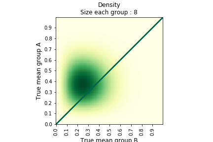
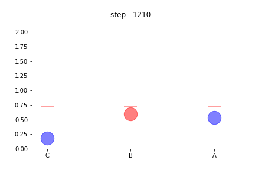
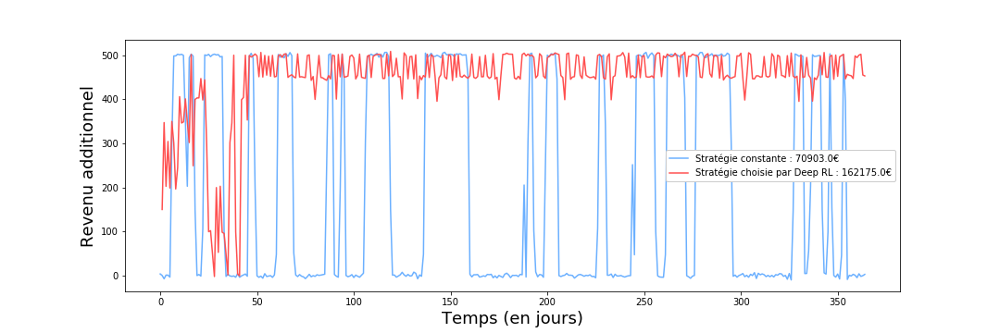

#### Before starting
You can launch the following command lines in your terminal before using the notebooks or the dash application.

##### Install dependancies
```
pip install -r requirements.txt
```
##### Generate example data
```
python generate_data_examples.py
```

# Continuous evaluation

My conviction is that continuous evaluation helps taking constantly better decisions and thus should be at the heart of 
organisations, in particular firms.

I am only talking about evaluation of actions, product, strategies and not at all the evaluation of individuals or groups 
of individuals. Continuous evaluation consist in testing and comparing options. An example is constituting randomly two 
(or more) groups of individuals, apply different options to the groups (promotion, content of an app, add content, etc.) 
and compare the kpi chosen (for instance conversion rate) to decide which option must be kept in the future.

### Why is it so important ?

First of all, evaluation enlightens our decisions : 
* it drives us to stop what cost and do not bring any value
* it strengthens our confidence in actions that have a positive impact
* it helps communicating about the results we achieve

Secondly, a constant and effective evaluation system will :
* bring to transform faster
* play down actions that does not work
* and thus allow to take more audacious decisions

This repo aim at showing how solutions can be implemented to make tests in different kind of context. Those tools can be
 used to evaluate more systematically and faster.


You will find here 4 main folders corresponding to 3 types of environments plus a folder for an example of dash 
application aiming at monitoring results

### 1 classic environments

Tests in classic environment ca be perform thanks to frequentest or bayesian techniques. For instance when using bayesian 
tests we will compute joint probability and associated risks and loss. Here is an example of density at the beginning of 
a bayesian test (8 people in each group).



### 2 multi armed bandit environments

Some problem of continuous evaluation can be thought as multi armed bandit problem and solve in a way that minimize the 
regret. For instance one can use algorithm such as upper confidence bound to determine continuously the option that 
will be applied. Here is an visualisation of such an algorithm.




### 3 dynamic environments

Sometime no group perform better than other in the long term, but some groups perform better than others sometime. 
We can for instance think about fashion which is a field with mayfly tendencies. One can use Deep Reinforcement learning 
to continuously evaluate the situation a take better decisions. Here is an example of the results


